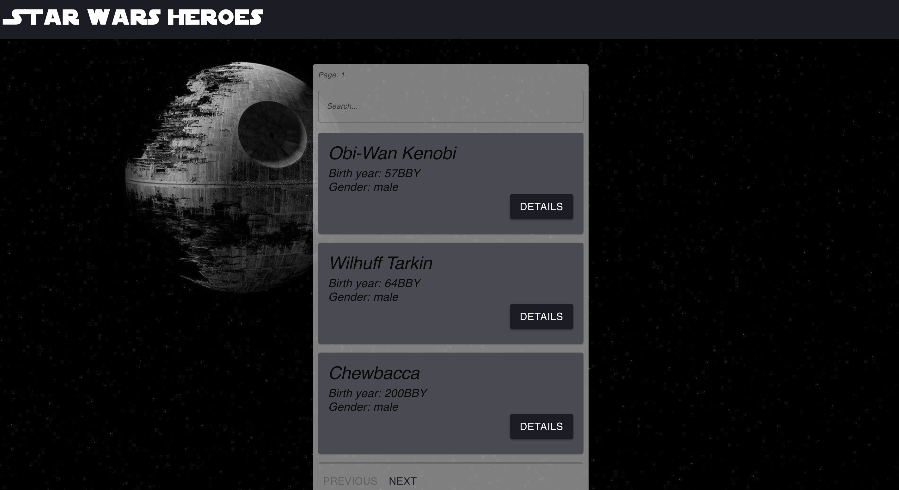
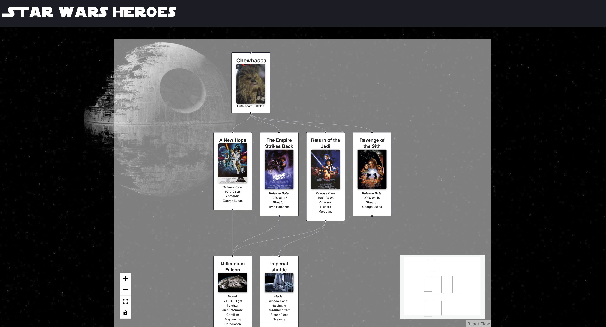
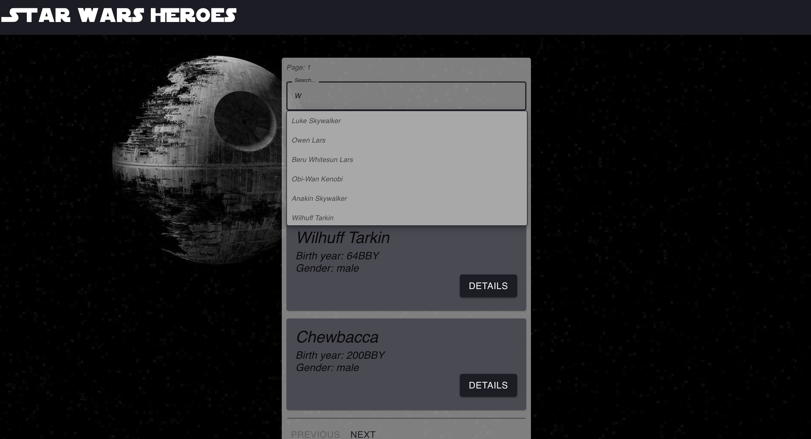

# StarWars Hero Explorer
Built with TypeScript, React, React Flow, Redux Toolkit

## 📜 Overview

The **StarWars Hero Explorer** is an interactive web application designed for Star Wars enthusiasts. It enables users to browse a detailed list of Star Wars heroes and explore associated information about starships and films. The app features a unique graph interface that visualizes connections between heroes, starships, and films, offering users an engaging way to understand these relationships. The integrated search bar further enhances the user experience by allowing quick and precise searches for heroes.

## 🚀 Technology Stack

This project leverages modern web technologies to deliver a robust and responsive user experience:

- ✅ **HTML (TSX), CSS** for structuring and styling the application.
- ✅ **TypeScript** for type safety and a better development experience.
- ✅ **React** for building dynamic, component-based user interfaces.
- ✅ **React Router** for seamless navigation within the application.
- ✅ **React Flow** for creating interactive graph visualizations.
- ✅ **Redux Toolkit** for efficient state management and scalability.
- ✅ **Material UI (MUI)** for a polished and responsive design system.
- ✅ **Jest** for unit testing and ensuring code quality.

## Installation and Usage

**Installation:**

* Clone the repository: git clone https://github.com/Marchenko1997/Star-WarsHeroes

**Usage:**

* Client
    - Navigate to the project directory: cd StarWars
    - Install dependencies: yarn install
        - Run the project: yarn start
        - Open a browser and navigate to: http://localhost:3000

____

## Examples

___________________________
___________________________

___________________________
___________________________

